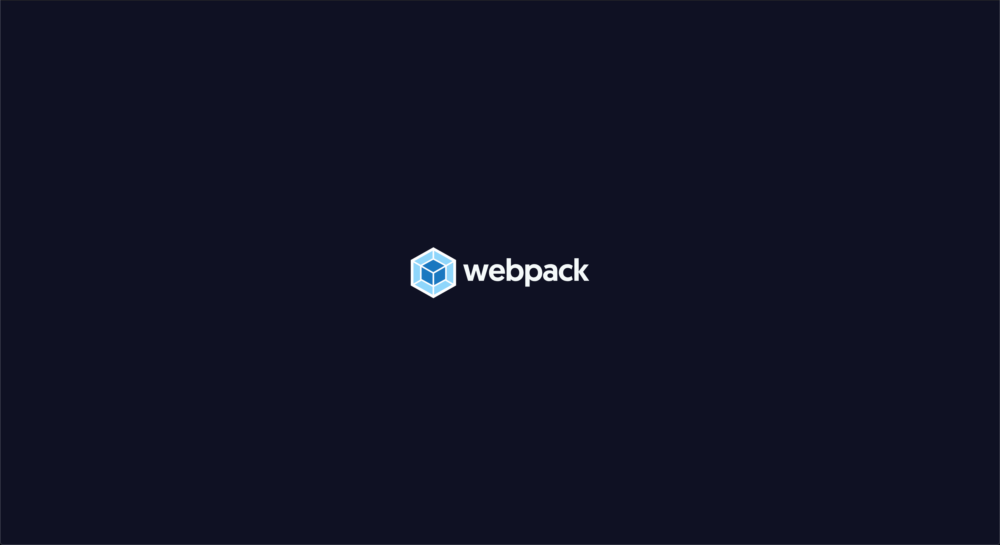

# Webpack Boilerplate

This repo contains boilerplate configuration of webpack.

## Master
The configuration in the `master` branch has the essential tools to build and serve using webpack dev server 
and also serve static files (compression included) over express server. 

## Other branches
There are other branches with build in common tools and libraries. 
Choose the one that is more suitable for you to base on your new project.  